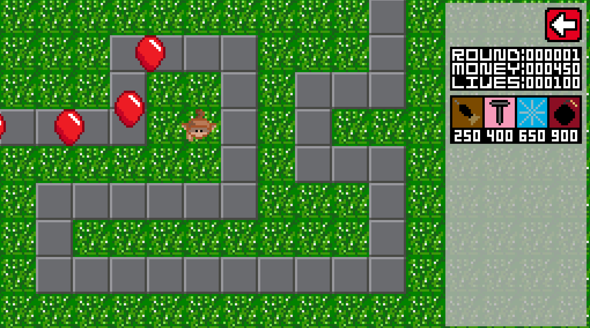
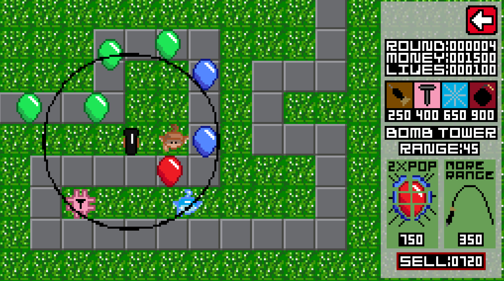

## Bloons Tower Defense: Prequel To The Prequel

Developed for Software Design and Testing Laboratory (LDTS) @ FEUP - L.EIC

Grade: 16.3/20

A mock version of ***Bloons TD1***.

### Controls 🎮

- **Left-click** - Interacts with the menus
- **ESC** - Go back/ Unselect tower

### Developed by 🧑🏻‍💻

- **Tiago Cruz** - [@Tiago27Cruz](https://www.github.com/Tiago27Cruz)
- **João Lourenço** - [@Tonevanda](https://www.github.com/Tonevanda)
- **Tomás Xavier** - [@dratomitoma](https://www.github.com/dratomitoma)